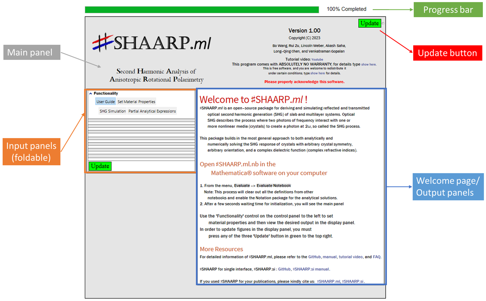

## Installation of _Mathematica®_

♯SHAARP._ml_ is written as a notebook using Wolfram Language and need to run with _Mathematica®_. _**However, a Mathematica license is not a prerequisite to run the package**_.

### _Mathematica®_ Notebook
- Instructions to install _Mathematica®_ (licensed) may be found [here](https://reference.wolfram.com/language/tutorial/InstallingMathematica.html). 
- If you already have a Wolfram account, you can log in through the [portal](https://account.wolfram.com/login) and download the software.

### Wolfram Player
-  Wolfram Player is a **free software** offered by _Mathematica®_ to interact with _Mathematica®_ Notebook.
- Wolfram Player is a free [download](https://www.wolfram.com/player/) and can be used to view and interact with _Mathematica®_ notebooks, but doesn't provide any editing functionalities

## Installation and Initialization of SHAARP._ml_

 ♯SHAARP._ml_ is a graphical user interface embedded in a  _Mathematica®_ notebook and requires either Wolfram Mathematica or Wolfram Player to use and interact with it. ♯SHAARP._ml_ can be downloaded from [GitHub](https://github.com/bzw133/SHAARP.ml)​ ​as a zip file or by cloning the repository. 
!!! note
	It is recommended to keep all the files in the same directory to access all the features provided by **SHAARP._ml_**.

1. Unzip the file. Open the main notebook file `SHAARP_ml_V#.##.nb​` using **_Mathematica®_** or **Wolfram Player**.

2. Making sure that Dynamic Evaluation is enabled, evaluate the notebook by clicking `Evaluation > Evaluate Notebook` from the menu bar. This process clears the definitions from the other currently open notebooks.

3. The main panel should now be visible after sometime. Please give at least 10 seconds for the initialization process. If you face issues, please re-evaluate the notebook or restart Mathematica. 
	- See [Warning message of SHAARP](<FAQ.md#Warning message of SHAARP>) in [FAQ](FAQ.md)

4. 
   

   The main panel contains the following sub-panels:

   -  **[Input panel](input.md)** for providing the material properties, polarimetry settings, simplifying assumptions, etc
   -  **[Output panel](output.md)** to display the optics geometry, generated polar plots, Maker fringes, partial analytical expressions, etc.
   -  **Update button** to run the calculations after specifying the various input parameters
   -  **Progress bar** to indicate the progress of the calculation after clicking Update
