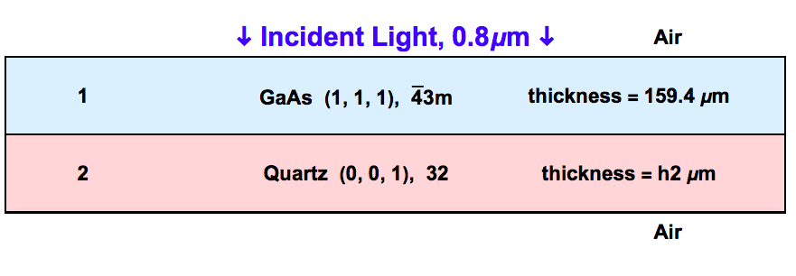
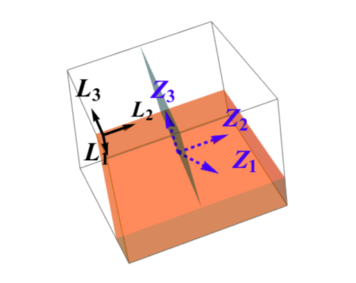
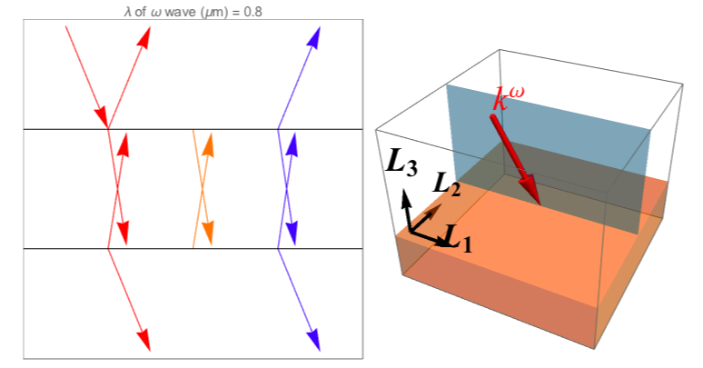
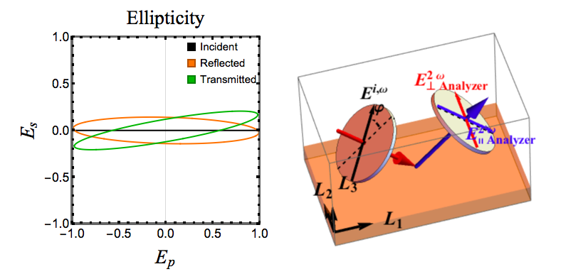
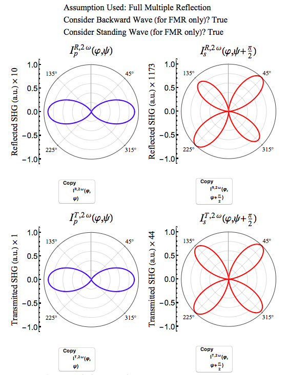
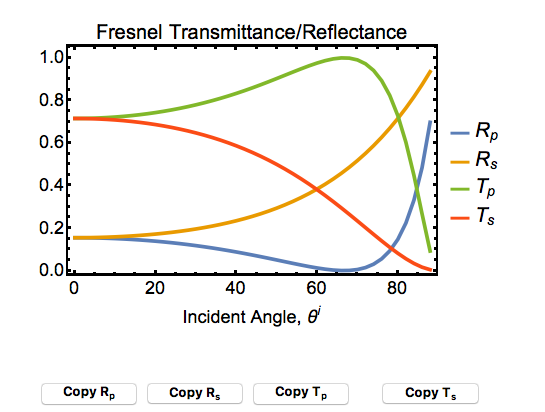
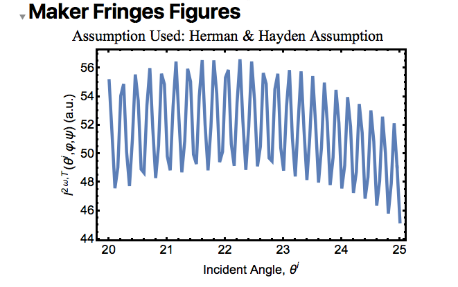

## Output panel

The output panel occupies the major part of the graphical interface. The content shown on the panel depends on the selected functionality. The possible outputs for the various functionalities are detailed below.

!!! note
	Please click on `Update` on the top right corner after specifying the inputs for the changes to take place. 

### Set Material Properties

-  The top figure describes the multilayer geometry including the background medium as the top-most and bottom-most layers. The layer name, Miller indices defining the crystal surface plane, point group and thickness is displayed for each layer.

-  The bottom figure highlights the relative orientation between the crystal physics axes $Z_1 Z_2 Z_3$ and the lab coordinate system $L_1 L_2 L_3$ for the layer selected in the `Material Selection` sub-panel. Note that for a given crystal symmetry, a definite relation exists between the crystal physics axes $Z_i$ and the $a$, $b$, $c$ axes of the crystal. Hence, the figure allows the visualization of the orientation of the selected layer. 
-  Depending on whether `2D Schematic` or `3D Schematic` is selected in the `Functionality` sub-panel, the bottom figure will be two-dimensional or three-dimensional. In case of the latter, the figure is interactive.  

### SHG Simulation

#### Optical geometry and polarization

The figure on the top-left presents a schematic of the multiple reflection of waves in the different layers. The red rays denote the waves at the fundamental frequency and the blue rays denote the second harmonic waves.

The figure on the top-right shows the fundamental incident wavevector $k^{\omega}$ and the plane of incidence in the lab coordinate system (defined by $L_1 L_2 L_3$).

The ellipticity of the incident, reflected and transmitted beams are presented in the figure at the bottom-left corner while the measurement geometry is described in the figure on the bottom-right.

#### Polar Plots

The sub-panel shows the polar plots of the reflected and transmitted intensities of the second harmonic wave as a function of the incident polarization angle $\varphi$. $\psi$ refers to the analyzer angle.

#### Fresnel Coefficients Figure

!!! note
	This sub-panel is available only if `Generate Fresnel Coefficients Plot` is checked in the `Calculation Controls` in the input panel.

A plot of the calculated Fresnel coefficients in steps of the provided step size is calculated and plotted.  

#### Maker Fringes Figure

!!! note
	This sub-panel is available only if `Generate Maker Fringes Plot` is checked in the `Calculation Controls` found in the input panel.

Plots of the calculated SHG intensity $I^{2 \omega}(\theta^i, \varphi, \psi)$ and $I^{2 \omega}(\theta^i, \varphi, \psi+90^{\circ})$ as a function of the incidence angle $\theta^i$ is calculated for fixed incident polarization angle $\varphi$ and fixed analyzer angle $\psi$ as provided in the `Maker Fringes Collection Settings` in the input panel. The assumption used for the calculation is also mentioned. 

### Partial Analytical Expressions

-  This panel contains the partial analytical expressions of the SHG reflectance and transmittance as a function of the polarizer angle $\varphi$ and the unknown parameters (thickness and SHG tensor) as provided in the `Set Material Properties` tab in the input panel.
-  One may copy the derived analytical expressions by clicking on the `Copy` button.

